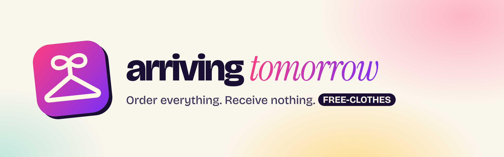

<h1 align="center">
  
</h1>

<p align="center"><b>🔗 <a href="https://arriving-tomorrow.vercel.app">arriving-tomorrow.vercel.app</a></b> · <b>📖 <a href="https://shankar-sachin.github.io/arriving-tomorrow/">Docs</a></b></p>

[](https://github.com/shankar-sachin/arriving-tomorrow/actions/workflows/ci.yml)
[](https://github.com/shankar-sachin/arriving-tomorrow/deployments)
[](https://arriving-tomorrow.vercel.app)
[](LICENSE)
[](https://www.typescriptlang.org/)
[](https://react.dev/)
[](https://vite.dev/)
[](PLAN.md#3-the-catalog-the-big-one)
[](#)
[](#)

**arriving tomorrow** (formerly Clothes Never Come) is the online store where you can order anything you want, and none of it ever arrives.

Browse thousands of garments from India, America, and classical Europe. Fill your cart.
Check out for **$0.00**: the details fill themselves in and the `FREE-CLOTHES` coupon applies automatically.
Then watch a delivery truck that is always arriving *tomorrow*.

No accounts. No credit cards. No clothes.

**Shop now (receive never):** https://arriving-tomorrow.vercel.app

## Features

- **6,120 procedurally generated products** across 3 regions, 15 categories, and 68 real garment archetypes (Banarasi sarees, sherwanis, cowboy boots, crinoline ball gowns, tricorne hats…)
- **Unique SVG art for every SKU**, built from silhouettes, palettes, and patterns
- **Shopping that feels real**: category chips, sorting, colour and price filters, search, infinite scroll, sizes, and a persistent cart
- **Self-filling parody checkout** with a typed-out coupon, a total that counts down to zero, and confetti
- **Order tracking that never resolves**: progress approaches 100% without reaching it, and the excuses rotate
- **Gift links**: send any order to a friend, who gets their own never-arriving tracking page (the gift lives entirely in the URL)
- **Customer support** from Brenda, a scripted agent whose excuses escalate the longer you chat
- **16 achievements**, like "Spent $10,000 on nothing"
- **Installable app** (Add to Home Screen from Safari, or Install in Chrome) and **dark mode**
- Spring animations everywhere, with `prefers-reduced-motion` respected throughout

## Getting started

```bash
npm install
npm run dev        # generates the catalog, then starts Vite
```

| Script | What it does |
| --- | --- |
| `npm run catalog` | Regenerates `public/catalog/` from the taxonomy (deterministic) |
| `npm run dev` | Catalog + dev server |
| `npm run build` | Catalog + typecheck + production build to `dist/` |
| `npm run typecheck` | `tsc` only |
| `npm test` | Vitest unit tests (generator, pricing, tracking, search) |

## How the catalog works

The catalog is read-only, so it ships as static data instead of living in a database:

1. `src/catalog/taxonomy.ts` holds hand-curated regions, categories, garment archetypes, fabrics, motifs, and colour palettes.
2. `src/catalog/generate.ts` expands them with a seeded PRNG into unique SKUs. The same seed always produces the same catalog, so URLs stay stable.
3. `scripts/build-catalog.ts` writes one JSON shard per category, plus `index.json` and `search.json`.

Want more stuff? Add archetypes to the taxonomy or raise `VARIANTS_PER_ARCHETYPE`. See [PLAN.md](PLAN.md) for the full plan, the database options, and the PR roadmap.

## AI product photos (Mac)

Product photos can be generated locally with [FLUX.1-schnell](https://huggingface.co/black-forest-labs/FLUX.1-schnell) (Apache-2.0) on an Apple Silicon Mac. That's one studio photo per garment type × colour family (612 images), matched to every product of that colour.

```bash
python3 -m venv .venv && source .venv/bin/activate
pip install -U mflux pillow
python3 scripts/generate_photos.py --limit 5     # quick test first
python3 scripts/generate_photos.py               # the full run; resumable, shows an ETA
git add public/photos/ai && git commit -m "Add AI product photos" && git push
```

The first run downloads the model, which needs around 35 GB of free disk. Use `--quantize 4` on 16 GB Macs if memory is tight. After pushing, `npm run photos:ingest-ai` adds the images to the catalog, and they go through the same review as every other photo (`photo-approved.json`, `npm run photos:prune`). Every AI image is labelled as AI-generated on its product page.

## Deployment

The site is hosted on **Vercel** at https://arriving-tomorrow.vercel.app. Every push to `main` deploys to production, and every pull request gets its own preview link. [`vercel.json`](vercel.json) sets the Vite build, the `dist/` output, and a rewrite so deep links work. More details are in the [wiki](https://github.com/shankar-sachin/arriving-tomorrow/wiki/Deployment).

## Documentation

The [wiki](https://github.com/shankar-sachin/arriving-tomorrow/wiki) covers architecture, the catalog generator, deployment, and an FAQ. Its source lives in [`wiki/`](wiki) and is published automatically on every merge to `main`.

**Documentation site:** https://shankar-sachin.github.io/arriving-tomorrow/ is a [VitePress](https://vitepress.dev) site (source in [`docs/`](docs)) with the guide, the AI photo pipeline, the roadmap and the changelog. It reuses the wiki Markdown and is deployed to GitHub Pages by `.github/workflows/docs.yml`. Run it locally with `npm run docs:dev`.

## Contributing

Outside pull requests aren't accepted, but issues are welcome. See [CONTRIBUTING.md](CONTRIBUTING.md). Everyone is expected to follow the [Code of Conduct](CODE_OF_CONDUCT.md).

## Changelog

See [CHANGELOG.md](CHANGELOG.md). Pushing a `v*` tag publishes a GitHub release with that version's notes.

## Security

See [SECURITY.md](SECURITY.md). Report vulnerabilities privately.

## License

[MIT](LICENSE) © 2026 shankar-sachin
